<p align="center"></p>

# rune codex page

[](https://github.com/abraira85/rune-codex-page/actions/workflows/validate.yml)
[](./LICENSE)
[](./CONTRIBUTING.md)
[](./CODE_OF_CONDUCT.md)

> Production-tested prompts, roles and configs for **Claude** and **Codex** — private by default, public when ready.

Everything here has actually been used somewhere real. Every item is tagged `production` or `experimental` — nothing ships just to pad the count.

## `~ ❯ ls catalog/`

Organized by **area** first — what you're looking for — then by tool and type:

| Area | For |
|---|---|
| [`engineering/`](./catalog/engineering) | General software development |
| [`database/`](./catalog/database) | Data modeling, SQL, query optimization |
| [`devops/`](./catalog/devops) | Infrastructure, CI/CD, cloud |
| [`security/`](./catalog/security) | Security review, hardening |
| [`data-ai/`](./catalog/data-ai) | ML, RAG, data pipelines, LLM ops |
| [`business/`](./catalog/business) | Leadership, product, strategy |
| [`qa/`](./catalog/qa) | Testing, quality assurance |

Each area repeats the same pattern — `claude/{agents,skills,mcp,hooks}` and `codex/{agents-md,prompts}` — see [`catalog/README.md`](./catalog/README.md) for the full layout.

## `~ ❯ cat CONVENTIONS.md`

Every item carries the same front-matter:

```yaml
---
name: short-identifier
status: production | experimental
context: "where and how it's actually used"
---
```

- **`production`** — running somewhere real, right now.
- **`experimental`** — still being tested, not yet trusted.

Full format in [`TEMPLATE.md`](./TEMPLATE.md). Every PR is checked automatically by [`scripts/validate.py`](./scripts/validate.py) in CI — see the badge above.

## `~ ❯ man install`

No package manager, but there is a small installer — it extracts the real
payload (the tool-relevant front-matter + the actual prompt) and drops it
where the target tool expects it, instead of you copying the whole
catalog file by hand:

```
python3 scripts/install.py catalog/qa/claude/agents/qa-lead.md
python3 scripts/install.py catalog/qa/claude/agents/qa-lead.md --target ../my-project
```

| Item type | Behavior |
|---|---|
| `<area>/claude/agents/*.md` | writes `.claude/agents/<name>.md` |
| `<area>/claude/skills/*/SKILL.md` | writes `.claude/skills/<name>/SKILL.md` |
| `<area>/claude/mcp/*.md` | prints only — JSON configs need a human to merge them |
| `<area>/claude/hooks/*.md` | prints only — same reasoning |
| `<area>/codex/agents-md/*.md` | writes `AGENTS.md` at the target root (refuses to overwrite an existing one without `--force`) |
| `<area>/codex/prompts/*.md` | prints only — no fixed destination |

It never overwrites an existing file silently. Prefer doing it by hand?
Every catalog file still reads fine on its own — the front-matter (`name`,
`status`, `context`) is this repo's metadata, and the fenced block under
"Prompt / instructions" is the exact content to paste.

## `~ ❯ man contributing`

Contributions are welcome — this isn't a solo drop, it's meant to grow. Start with [`CONTRIBUTING.md`](./CONTRIBUTING.md) for the workflow, [`CODE_OF_CONDUCT.md`](./CODE_OF_CONDUCT.md) for how we treat each other, and [`SECURITY.md`](./SECURITY.md) if what you found is a security issue rather than a bug. Everyone who lands an item gets listed in [`CONTRIBUTORS.md`](./CONTRIBUTORS.md).

Releases follow [Semantic Versioning](https://semver.org/) and are tracked in [`CHANGELOG.md`](./CHANGELOG.md).

## `~ ❯ roadmap`

- [x] First real items in the catalog (`qa/` team: 6 agents, 2 skills)
- [ ] A generated `index.json` so the catalog is machine-readable
- [ ] Tagged `v0.1.0` once there's enough here to call a first release

## `~ ❯ whoami`

Built by [Rober de Ávila Abraira](https://github.com/abraira85) — [outboss.io](https://outboss.io)
